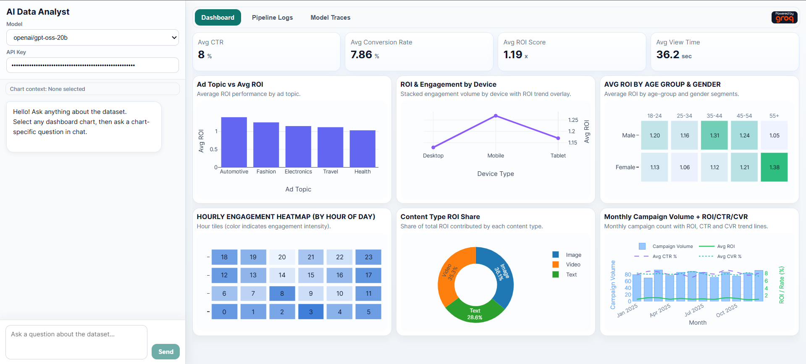
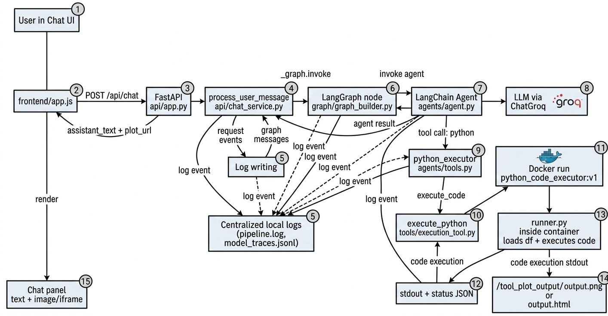

# LangChain Chatbot - AI Data Analyst

A web-based AI data analyst that chats over a marketing dataset, executes Python analysis code safely in Docker, renders dashboard charts, and exposes observability logs for pipeline/model traces.


## Features

- Chat UI with model selection and optional API key override
- Dashboard with KPI cards + interactive Plotly charts
- Chart-aware chat context (select a chart, then ask chart-specific questions)
- Python tool execution in an isolated Docker container
- Plot output handling (PNG/HTML) and in-chat plot rendering
- Pipeline + model trace logging with live log tabs

## Architecture

- **Frontend** (`frontend/`): Chat panel, dashboard UI, chart rendering, log polling
- **API layer** (`api/app.py`): FastAPI endpoints for chat, dashboard, and logs
- **Chat service** (`api/chat_service.py`): Session state, graph invocation, trace logging
- **Graph + agent** (`graph/`, `agents/`): LangGraph state flow and LangChain agent setup
- **Tool execution** (`agents/tools.py`, `tools/execution_tool.py`, `runner.py`): Executes generated Python code against dataset inside Docker
- **Dashboard builder** (`dashboard/charts.py`): KPI and Plotly payload generation from CSV
- **Observability** (`observability/tracing.py`): Structured model traces + readable pipeline logs

Detailed request flow is documented in [`SEQUENCE_DIAGRAM.md`](./SEQUENCE_DIAGRAM.md).

1. Frontend sends `POST /api/chat` with user message and optional selected chart context.
2. API calls `process_user_message(...)`.
3. Chat service invokes LangGraph, which invokes the agent + LLM.
4. If needed, LLM calls the `python` tool.
5. Tool executes code in Docker (`python_code_executor:v1`) and may write plot output to `tool_plot_output/`.
6. Response returns as `assistant_text` + optional `plot_url`.
7. Frontend renders answer, plot, dashboard updates, and logs.

## Project Structure

```text
langchain_chatbot/
|-- api/
|   |-- app.py                   # FastAPI app and routes
|   `-- chat_service.py          # Session handling + graph invocation
|-- agents/
|   |-- agent.py                 # Agent + model selection
|   |-- prompts.py               # System prompt
|   `-- tools.py                 # Tool wrapper exposed to agent
|-- dashboard/
|   |-- __init__.py
|   `-- charts.py                # KPI + Plotly dashboard payloads
|-- frontend/
|   |-- index.html               # Main UI shell
|   |-- styles.css               # UI styling
|   `-- app.js                   # Chat, dashboard, logs, modal interactions
|-- graph/
|   `-- graph_builder.py         # LangGraph state graph
|-- logs/
|   |-- pipeline.log             # Human-readable pipeline log lines
|   `-- model_traces.jsonl       # Structured model/tool traces
|-- observability/
|   |-- __init__.py
|   `-- tracing.py               # Logging, trace context, log readers
|-- raw_data/
|   `-- cleaned_data.csv         # Dataset used by dashboard + tool
|-- tools/
|   `-- execution_tool.py        # Docker execution bridge
|-- tool_plot_output/            # Generated plots served as static files
|-- Dockerfile                   # Executor image (runner.py)
|-- main.py                      # Terminal chat entry point
|-- runner.py                    # In-container code executor runtime
|-- requirements.txt             # Python dependencies
|-- SEQUENCE_DIAGRAM.md          # End-to-end sequence flow (Mermaid)
`-- .env                         # Local environment variables (not for commit)
```

## API Endpoints

- `GET /` -> serves frontend
- `POST /api/chat` -> returns `assistant_text`, `session_id`, optional `plot_url`
- `GET /api/dashboard` -> dashboard KPI + chart payload
- `GET /api/logs/pipeline` -> session-filtered pipeline logs
- `GET /api/logs/traces` -> session-filtered model traces
- `GET /frontend/*` and `GET /tool_plot_output/*` -> static files

## Local Setup

### 1) Create and activate virtual environment

```bash
python -m venv .venv
.venv\Scripts\Activate
```

### 2) Install dependencies

```bash
pip install -r requirements.txt
```

### 3) Configure environment

Create/update `.env` with your provider key:

```env
GROQ_API_KEY=your_key_here
```

### 4) Build Docker executor image (required for Python tool calls)

From project root:

```bash
docker build -t python_code_executor:v1 .
```

### 5) Run the web app

```bash
uvicorn api.app:app --reload
```

Open [http://localhost:8000](http://localhost:8000).

## Usage Notes

- Select a dashboard chart to attach chart context to chat.
- Ask analysis questions; the model can call the Python tool when needed.
- Pipeline and model trace tabs update automatically.
- Chat plot images in assistant responses support click-to-enlarge modal view.

