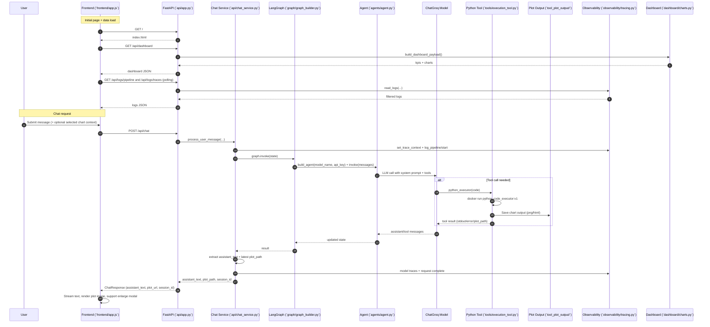

# Project Sequence Diagram

```mermaid
sequenceDiagram
    autonumber
    participant U as User
    participant FE as Frontend (`frontend/app.js`)
    participant API as FastAPI (`api/app.py`)
    participant CS as Chat Service (`api/chat_service.py`)
    participant G as LangGraph (`graph/graph_builder.py`)
    participant A as Agent (`agents/agent.py`)
    participant LLM as ChatGroq Model
    participant T as Python Tool (`tools/execution_tool.py`)
    participant FS as Plot Output (`tool_plot_output/`)
    participant OBS as Observability (`observability/tracing.py`)
    participant DB as Dashboard (`dashboard/charts.py`)

    Note over FE: Initial page + data load
    FE->>API: GET /
    API-->>FE: index.html

    FE->>API: GET /api/dashboard
    API->>DB: build_dashboard_payload()
    DB-->>API: kpis + charts
    API-->>FE: dashboard JSON

    FE->>API: GET /api/logs/pipeline and /api/logs/traces (polling)
    API->>OBS: read_logs(...)
    OBS-->>API: filtered logs
    API-->>FE: logs JSON

    Note over U,FE: Chat request
    U->>FE: Submit message (+ optional selected chart context)
    FE->>API: POST /api/chat
    API->>CS: process_user_message(...)
    CS->>OBS: set_trace_context + log_pipeline/start
    CS->>G: graph.invoke(state)

    G->>A: build_agent(model_name, api_key) + invoke(messages)
    A->>LLM: LLM call with system prompt + tools

    alt Tool call needed
        LLM->>T: python_executor(code)
        T->>T: docker run python_code_executor:v1
        T->>FS: Save chart output (png/html)
        T-->>LLM: tool result (stdout/error/plot_path)
    end

    LLM-->>A: assistant/tool messages
    A-->>G: updated state
    G-->>CS: result
    CS->>CS: extract assistant_text + latest plot_path
    CS->>OBS: model traces + request complete
    CS-->>API: assistant_text, plot_path, session_id
    API-->>FE: ChatResponse (assistant_text, plot_url, session_id)

    FE->>FE: Stream text, render plot image, support enlarge modal
```

